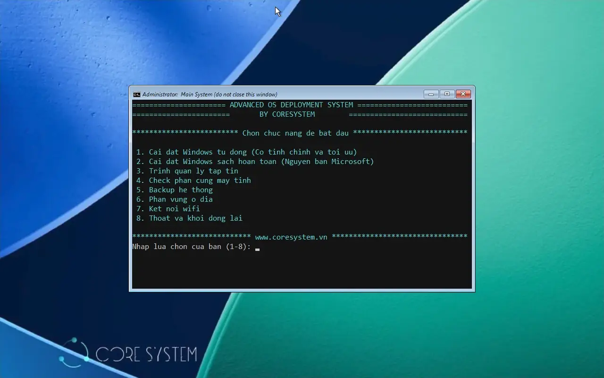

# OSDCloud

Một dự án nho nhỏ từ [CoreSystem](https://coresystem.vn) với mong muốn hỗ trợ anh em IT cài đặt Windows 11 chuẩn "ngành" cho nhu cầu doanh nghiệp với các tiêu chí

- Luôn luôn cài đặt **nguồn sạch từ Microsoft** và update mới nhất
- Toàn bộ thời gian cài đặt chỉ gói gọn **trong 30-45 phút** tùy tốc độ mạng Internet 
- Tùy biến **automation chuẩn doanh nghiệp** thông qua việc xóa các ứng dụng bloatware có sẵn trong Windows, cài đặt bổ sung ứng dụng phù hợp môi trường văn phòng
- Đáp ứng **tối đa nền tảng phần cứng bảo mật hiện đại** khi các hãng thiết bị siết chặt áp dụng firmware UEFI kết hợp khóa SecureBoot và chip bảo mật TPM2
- Ngoài tính năng chủ đạo là cài đặt Windows thì hệ thống boot cũng hỗ trợ các công cụ bổ sung như kiểm tra phần cứng máy tính, quản lý phân vùng và sao lưu ổ đĩa giúp việc cài đặt an toàn, yên tâm hơn
- 100% miễn phí và mã mở, hệ thống không dùng bất kỳ phần mềm thương mại nào có thể gây ảnh hưởng trực tiếp hoặc gián tiếp tới các tranh chấp pháp lý doanh nghiệp

Phù hợp cho đa dạng thiết bị phần cứng từ các công ty như HP, Dell, Lenovo...

Để hệ thống ra đời, không thể không nhắc đến nền tảng [OSDCloud](https://www.osdeploy.com), autounattended.xml đến từ [Christoph Schneegans](https://schneegans.de/christoph/) cũng như sự hỗ trợ không ngừng nghỉ của [Gemini](https://gemini.google.com) để tối ưu logic và code xử lý automation liên quan ❤️❤️❤️

****🔰 Test trong môi trường business 🔰****

✅ Cài đặt OS, đặt password local admin, rename computer, join active directory domain, áp policy (OK)

✅ Cài đặt OS, đặt password local admin, rename computer, join EntraID, bật Bitlocker lưu trữ recovery key online (OK)

✅ Hỗ trợ hệ thống boot PXE chẳng hạn WDS (Windows Deployment Services)

🚨 ****Ghi chú khác**** 🚨

🧱 Ở các công ty có firewall, việc cài đặt có thể gặp chút trục trặc vì ở giai đoạn Post-setup, hệ thống cần tải các ứng dụng từ (MS/Windows Store, Github). Cần thiết lập tường lửa cho phép kết nối đến các dịch vụ này (**Application Control**) (OK)

🧱 Để tối ưu nhất, nên tách riêng hệ thống deploy ra một VLAN riêng có kết nối trực tiếp Internet, điều này hữu ích khi không có broadcast gây gián đoạn mạng production cũng như các quy tắc từ firewall có thể gây gián đoạn hoặc sai lệch quá trình cài đặt từ Internet

**Giao diện chính**

**Demo video**

Toàn bộ quá trình cài đặt chỉ khoảng 25 phút. Thực sự ấn tượng phải không?

https://github.com/user-attachments/assets/000f333a-9fd0-4fff-a8f1-750a3c13c7d2

