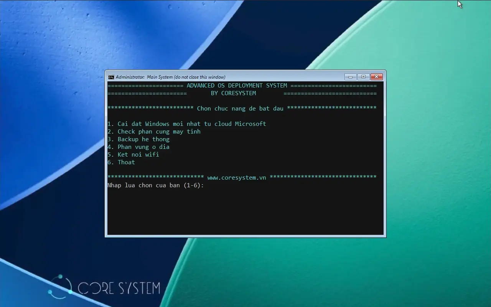

# OSDCloud

Một hành trình dự án nho nhỏ từ [CoreSystem](https://coresystem.vn) với mong muốn hỗ trợ anh em IT cài đặt Windows 11 chuẩn "ngành" cho nhu cầu doanh nghiệp với các tiêu chí

- Luôn luôn cài nguồn sạch từ Microsoft và update mới nhất
- Toàn bộ thời gian cài đặt chỉ gói gọn **trong 30-45 phút** tùy tốc độ mạng Internet 
- Tùy biến **automation chuẩn doanh nghiệp** thông qua việc xóa các ứng dụng bloatware tặng kèm, cài đặt bổ sung ứng dụng phù hợp môi trường văn phòng
- Đáp ứng tối đa nền tảng phần cứng bảo mật hiện đại với việc áp dụng firmware UEFI kết hợp SecureBoot và chip bảo mật TPM2
- Ngoài tính năng chủ đạo là cài đặt Windows thì hệ thống boot cũng hỗ trợ các công cụ bổ sung như kiểm tra phần cứng máy tính, sao lưu ổ đĩa giúp việc cài đặt an toàn, yên tâm hơn
- 100% miễn phí và mã mở, hệ thống không dùng bất kỳ phần mềm thương mại nào có thể gây ảnh hưởng trực tiếp hoặc gián tiếp tới doanh nghiệp

Phù hợp cho đa dạng phần cứng từ các công ty như HP, Dell, Lenovo...

Để hệ thống ra đời, không thể không nhắc đến nền tảng [OSDCloud](https://www.osdeploy.com) cũng như sự hỗ trợ không ngừng nghỉ của bé [Gemini](https://gemini.google.com) để tối ưu logic và code xử lý automation liên quan ❤️❤️❤️

Demo video

<https://github.com/tructransecure/OSDCloud/blob/46667048cecb8766063a20b7c1c26a91b8da4a16/Resources/video.mp4>